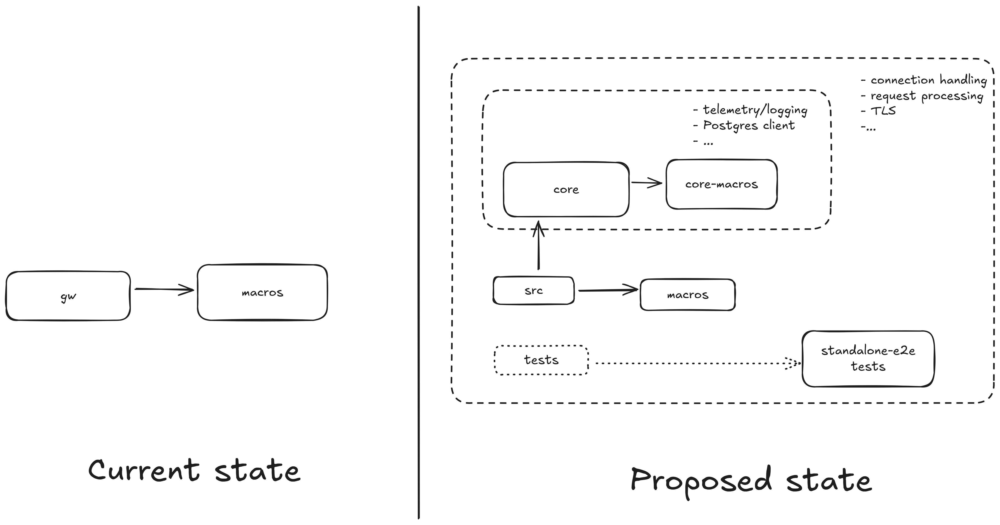

# Crate Structure Design

The gateway is implemented in Rust and organized as a set of crates and modules. To improve maintainability and reusability, we propose the following logical crate layout:

The main crates and responsibilities:

* `oss-core-gw`
  * Provides runtime primitives used by the gateway: PostgreSQL integration (connection pooling, transaction management, connection metrics, and retries), shared services (telemetry, logging), and other cross-cutting resources.

* `oss-docdb-gw`
  * Implements MongoDB wire-protocol handling: request parsing, authentication, routing to processing logic, and response construction. Depends on the core crate for database access and observability.

* `macros`
  * A small procedural-macro crate containing code-generation helpers to reduce boilerplate across the gateway.

Benefits:

* Clear separation of concerns — protocol handling, storage, and cross-cutting services are separated, improving modularity and enabling reuse of the storage core across multiple protocol gateways.
* Extensibility — the split makes it easier to add new protocol implementations or replace components with minimal impact.
* Easier contribution and onboarding — smaller, well-defined components reduce the barrier to contribution and simplify maintainability.
* Configuration portability — configuration and deployment artifacts can be reused across different gateway implementations.
* Simplified migration and testing — isolated components make data migration, testing, and debugging easier and reduce test maintenance overhead.